# Qt 入门：从认识 Qt 到机器人状态面板

本文介绍 Qt 的用途、下载安装、项目运行和可视化编辑，再通过两个独立小工程说明 QML 与 C++ 之间的数据交互。

示例使用本地模拟的机器人血量，无需机器人或服务器。第 5、6 章包含全部源码，源码获取方式见第 3 章，下载后可直接打开工程。

> 本文配有实际操作截图，主要环境为 Linux、Qt 6.11.1、Qt Creator 19.0.2 和 Qt Online Installer 4.11.0。安装选项图引用 Qt 官方文档，并单独注明来源。图片保存在同级 `images/` 目录，使用相对路径；可打开图片查看原始尺寸。截图中的临时工作目录仅用于演示，实际操作使用自己的源码目录。菜单文字和控件样式可能随版本、系统变化。

## 1. Qt 是什么，可以用来做什么

### 1.1 从一个日常软件理解 Qt

一个机器人状态软件通常需要窗口、按钮、血量条、地图，还要接收数据、响应点击、保存配置。Qt 提供实现这些功能的库和工具，让开发者能够在已有基础上编写应用程序。

**Qt 是一个跨平台的应用程序开发框架。** 它提供界面、网络、数据处理等能力，可用于桌面、移动和嵌入式应用。跨平台通常意味着复用大量源码，并针对各平台分别构建和适配。[Qt 官方：Qt 简介](https://doc.qt.io/qt-6/qt-intro.html)

在本例中，C++ 负责血量数据和变化规则，QML 负责描述面板的外观和交互。

### 1.2 能做哪些程序

| 应用场景 | 具体例子 | 可以在 Qt 中做的工作 |
| --- | --- | --- |
| 机器人上位机 | 查看机器人状态、显示传感器数据 | 界面展示、输入操作、数据通信 |
| 工业监控 | 温度、压力、设备报警面板 | 实时显示、参数设置、告警提示 |
| 桌面工具 | 配置编辑器、数据查看器 | 表单、文件操作、列表与图形展示 |
| 嵌入式屏幕 | 仪器或设备上的触摸操作界面 | 按钮、状态显示、交互动画 |

这些是应用设计示例。真正接入设备时，还需要实现对应的通信协议和业务逻辑。下面通过示例说明界面与数据之间的联系。


图 1：机器人状态面板的初始状态。血量文字、进度条和两个按钮都来自后文的小工程。

### 1.3 Qt、Qt Creator 和 QML 分别是什么

| 名称 | 是什么 | 用途 |
| --- | --- | --- |
| Qt | 应用开发框架 | 提供程序需要的库与能力 |
| Qt Creator | 集成开发环境（IDE） | 打开工程、编辑、构建、运行和调试 |
| C++ | 编程语言 | 实现血量、受击和恢复的规则 |
| QML | 描述对象、属性和界面的语言 | 写面板布局、文字和交互 |
| Qt Quick | QML 界面技术 | 构建示例的窗口内容 |
| Qt Quick Controls | 常用控件库 | 提供 `Button`、`Label`、`ProgressBar` |
| Qt Quick Designer | Creator 中的 QML 可视化编辑工具 | 选择控件、修改外观和布局 |
| Qt Design Studio | 面向界面设计的独立工具 | 编辑和预览 QML 界面，可作为设计工具选择 |
| CMake | 构建配置工具 | 告诉编译工具要编译哪些文件、链接哪些库 |
| 编译器 | 把 C++ 源码编译成程序的工具 | Linux 常见 GCC，Windows 可用 MinGW 或 MSVC |

使用 Qt Creator 构建程序时，还需要安装 Qt 开发库和匹配的编译工具链，并确认它们已被正确识别。

### 1.4 示例采用的界面技术

Qt 有不同的界面开发方式。本文使用 **Qt Quick + QML**，适合以面板、状态展示和交互为主的练习。

| 文件 | 用途 |
| --- | --- |
| `.cpp` / `.h` | C++ 实现与声明 |
| `.qml` | 窗口、组件、绑定和交互 |
| `.ui.qml` | 供可视化设计工具编辑的 QML 表单 |
| `.qmlproject` | 设计预览的工程入口 |
| `CMakeLists.txt` | 完整 C++ 应用的工程入口 |
| `.qrc` | 要随程序构建的资源清单 |

如果看到 `QWidget`、`QMainWindow` 和 XML `.ui` 文件，那是 Qt Widgets 的界面路线。本文中的项目采用上表所列的文件类型。

## 2. 下载与安装 Qt 开发环境

### 2.1 安装前先确定三件事

确认自己的操作系统、处理器架构，以及准备安装的 Qt 版本。示例代码要求 **Qt 6.5 或更新版本、C++17、CMake 3.21 或更新版本**；现有示例已在 Linux、Qt 6.11.1、GCC 环境验证。

这里的 Qt 版本指 Kit 使用的开发库版本，与 Qt Creator 自身的版本不同。Qt 6.5 是源码声明的最低要求，并不表示已经逐个测试所有 Qt 6 版本；本次复现环境和未覆盖的平台见 [复现检查报告](docs/REPRODUCIBILITY.md)。

选择满足示例要求的 Qt 6 桌面版本及匹配工具链。具体可安装版本以在线安装器显示为准，不必为了入门同时安装多个版本。

Qt 安装位置可按本机情况选择，示例没有写死 Qt 的安装路径。

Linux 还应检查发行版和系统库版本。以本例使用的 Qt 6.11 官方 x86_64 二进制包为例，需要 glibc 2.34 或更新版本；不能仅凭“都是 Linux”就认为旧系统或 ARM 设备能使用同一安装包。先对照所选版本的 [Qt 官方 Linux 支持表](https://doc.qt.io/qt-6/linux.html)，再选择对应架构和工具链。

### 2.2 从官网下载在线安装器

1. 打开 [Qt 官方开源下载入口](https://www.qt.io/development/download-qt-installer-oss)。下面以该入口的在线安装流程为例。
2. 选择与电脑操作系统和架构相匹配的安装器，例如 Windows x64 或 Linux x64。
3. 下载 **Qt Online Installer**。这是用于选择并下载 Qt 组件的安装程序。
4. 按官网提示注册或登录 Qt Account，并完成邮箱验证。[Qt 官方下载与账号步骤](https://www.qt.io/development/download-qt-installer-oss)

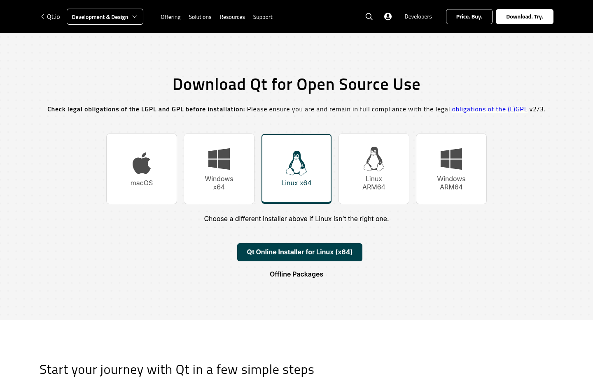

图 2：先选择操作系统和架构，再点击下方的 Qt Online Installer 下载按钮。Windows 选择 Windows x64 等对应项。

### 2.3 使用镜像启动安装器

下载 Qt 组件较慢时，可在启动在线安装器时加入 `--mirror` 参数，指定中国科学技术大学镜像。下面的命令仍然打开图形安装界面，后续照常登录和选择组件；实际下载速度取决于网络和镜像状态。[中科大镜像使用说明](https://mirrors.ustc.edu.cn/help/qtproject.html)

**Windows（PowerShell）：** 将下载的安装器重命名为 `qt-online-installer.exe`，在文件所在文件夹打开 PowerShell，执行：

```powershell
.\qt-online-installer.exe --mirror https://mirrors.ustc.edu.cn/qtproject
```

也可以保留原文件名，将命令中的 `qt-online-installer.exe` 替换为实际名称。要使用镜像参数，应通过上述命令启动；直接双击文件不会带上这次指定的参数。

**Linux：** 可以将下载的 `.run` 文件重命名为 `qt-online-installer.run`，在该文件所在目录打开终端执行：

```bash
chmod +x ./qt-online-installer.run
./qt-online-installer.run --mirror https://mirrors.ustc.edu.cn/qtproject
```

第一条命令赋予执行权限，第二条带镜像参数启动安装器。这里的 `./` 表示当前目录；文件名应与实际保存的文件一致。

`--mirror` 后填写镜像的 Qt 根地址，使用上面的 `https://mirrors.ustc.edu.cn/qtproject` 即可，不要追加 `/online/qtsdkrepository/...`。此参数用于开源组件的元数据与下载源，账号登录仍按安装器提示进行。[Qt 官方：指定镜像](https://doc.qt.io/qt-6/get-and-install-qt-cli.html#selecting-mirror-for-opensource)

若镜像暂时不可用，退出安装器，去掉 `--mirror` 及其后的地址重新启动，恢复默认下载方式。镜像不能代替 Qt Account 登录，也不保证账号服务的连接速度。中科大镜像主要同步仍在维护的版本；找不到旧版本或组件下载失败时，先核对版本是否在镜像范围内，再尝试默认源。不要把博客里的某个版本仓库子目录直接替换为 `--mirror` 地址。[中科大镜像范围与参数说明](https://mirrors.ustc.edu.cn/help/qtproject.html)

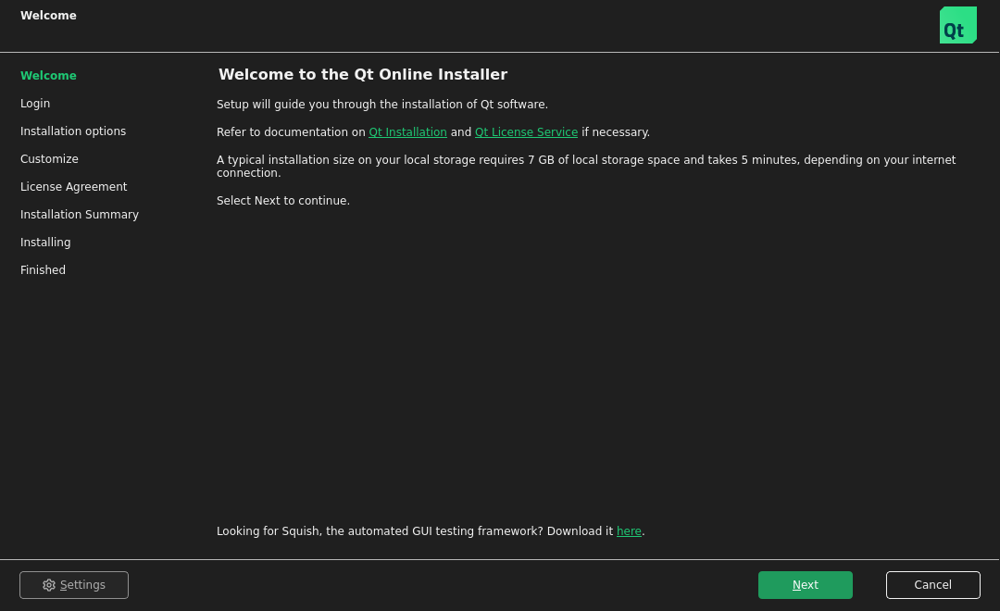

图 3：执行上述带 `--mirror` 参数的命令后，仍会打开图形安装器。镜像参数在启动命令中指定，不会显示为欢迎页中的选项。

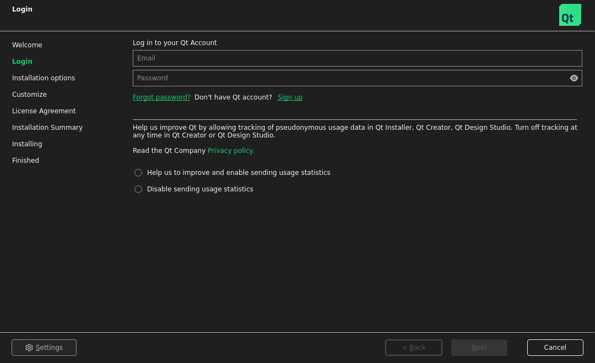

图 4：点击 Next 后进入账号登录页；没有账号时可使用 Sign up 入口注册。

Linux 的编译器等开发工具一般由系统提供。Ubuntu / Debian 系统可先安装基础构建工具；以下是该类系统的安装命令，不用于 Windows：

```bash
sudo apt update
sudo apt install build-essential gdb cmake ninja-build libgl1-mesa-dev
sudo apt install libxcb-cursor0 libxkbcommon-x11-0
```

上面包含基础构建工具、OpenGL 开发依赖和常见的 XCB 运行依赖，并非所有发行版的完整依赖清单。Ubuntu / Debian 的精简系统可能还缺其他图形库；遇到 `xcb` 错误时按第 10.2 节查看具体缺失项。只通过 SSH 登录且没有图形显示服务时，即使安装了库也不能直接显示窗口。[Qt 官方：Linux 开发环境](https://doc.qt.io/qt-6/linux.html)

### 2.4 选择安装位置和组件

登录后，按安装器提示选择安装目录。初学时保留合适的默认目录即可，并记下位置，后续查找维护工具时会用到。

选择 **Desktop / 桌面开发**。如果需要逐项选组件，进入 **Custom Installation / 自定义安装**。安装器的分组名可能变化，下表按“要装什么”进行核对。[Qt 官方：在线安装流程](https://doc.qt.io/qt-6/qt-online-installation.html)

| 项目 | 如何选择 | 为什么需要 |
| --- | --- | --- |
| Qt 6 桌面开发库 | 选择所需 Qt 6 版本对应的桌面包 | 提供 Core、Gui、Qml、Quick、Quick Controls 等能力 |
| Qt Creator | 安装 | 编辑、构建、运行完整工程 |
| 编译器或工具链 | 与 Qt 桌面包匹配 | 编译 C++ |
| CMake、Ninja 等构建工具 | 确认可用，可使用安装器提供的版本 | 配置工程并执行构建 |
| Qt 文档和示例 | 可选 | 查阅文档与示例 |
| Qt Design Studio | 可选，按可视化编辑需要安装 | 独立进行可视化设计 |

Qt Quick 等能力可能已经包含在所选桌面 Qt 包中，不一定各有一个同名复选框。关键是后续能找到示例所需模块。

**Windows：** 如果采用 MinGW，选择对应的 Qt MinGW 桌面包及匹配的 MinGW 编译工具；如果采用 MSVC，则安装对应的 Visual Studio C++ 工具链并选择 Qt MSVC 包。编译器和 Qt 包要匹配。[Qt 官方：Windows 工具链支持](https://doc.qt.io/qt-6/windows.html)

MinGW 工具链应使用与所选 Qt 包配套的版本；MSVC 工程需要 Visual Studio 的 C++ 桌面开发工具，调试时还需要相应调试器。仅安装 Qt Creator 或 Visual Studio Code 不会自动补齐这些组件。[Qt 官方：编译器配置](https://doc.qt.io/qtcreator/creator-tool-chains.html)

**Linux：** 通常选择对应架构的 GCC 桌面包，并使用系统安装的 GCC。不要选择交叉编译到另一种设备的套件作为当前桌面 Kit。

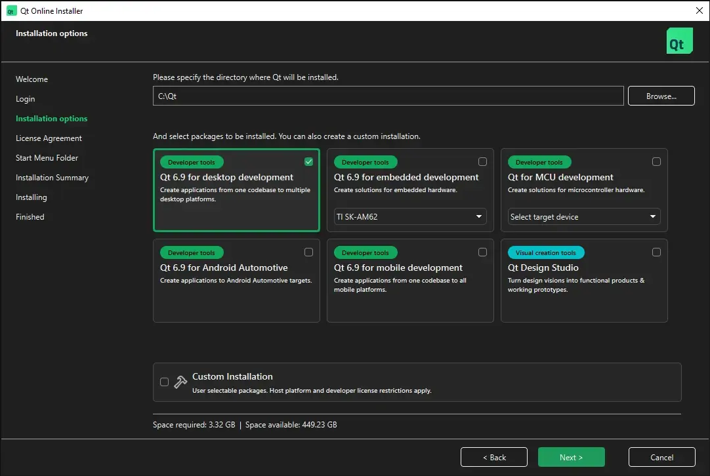

图 5：上方输入安装目录，中间选择桌面开发，底部 Custom Installation 可进入自定义组件选择。此图是从 [Qt 官方安装文档](https://doc.qt.io/qt-6/qt-online-installation.html) 的示例图截取的参考图，展示 Windows 和 Qt 6.9；它用于说明选项位置，版本与路径按实际环境选择。

按提示阅读安装条款、确认选择并等待安装完成。首次安装需要联网下载组件。

### 2.5 安装后先检查 Kit

打开 **Qt Creator**，进入设置或首选项中的 **Kits / 构建套件**。不同版本可能从“工具 → 选项”或“Preferences”进入。

Kit 可以理解成“这次用哪套工具来构建程序”。核对下面几项：

| 检查项 | 应当看到什么 |
| --- | --- |
| Qt 版本 | 刚安装的桌面 Qt 6 |
| C++ 编译器 | 与 Qt 包匹配的 GCC、MinGW 或 MSVC |
| CMake | 已检测到的 CMake 工具 |
| 调试器 | 适用于所选工具链的调试工具 |
| Kit 状态 | 没有阻止构建的错误提示 |

Qt Creator 的工程配置依赖 Kit；打开工程时也可以进入 Kit 设置检查。具体设置入口参见 [Qt 官方：打开和配置工程](https://doc.qt.io/qtcreator/creator-project-opening.html)。

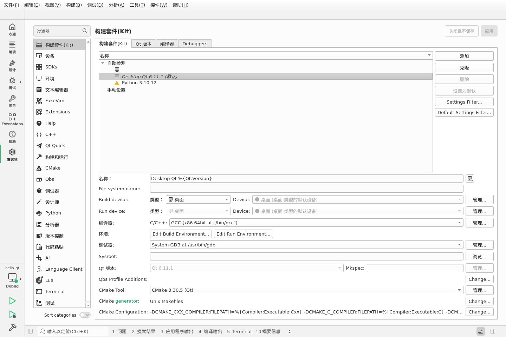

图 6：在构建套件列表中选中 Desktop Qt，检查下方的编译器、调试器、Qt 版本和 CMake。图中的 Python Kit 与这两个示例无关。

**没有自动检测到桌面 Kit 时：**

1. 打开“首选项 / 选项 → Kits”，在 Qt Versions / Qt 版本页选择“添加”，定位到所安装桌面 Qt 的 `bin/qmake`（Windows 为 `qmake.exe`）。不要选 Creator 自身目录里的工具。
2. 检查 Compilers / 编译器、Debuggers / 调试器、CMake 页面；补齐没有自动识别的工具。
3. 在 Kits 页添加桌面 Kit，关联刚才的 Qt 版本、匹配编译器、调试器和 CMake，再回到工程配置页选择它。

系统中存在多个 Qt 时，检查 Kit 指向的实际路径；不要把 GCC、MinGW、MSVC 或不同架构的库混在同一个 Kit 中。[Qt 官方：添加 Kit](https://doc.qt.io/qtcreator/creator-targets.html)

如果漏装了组件，打开 Qt 安装目录中的 **Maintenance Tool / 维护工具**，添加或移除对应组件即可。[Qt 官方：维护已安装组件](https://doc.qt.io/qt-6/qt-online-installation.html)

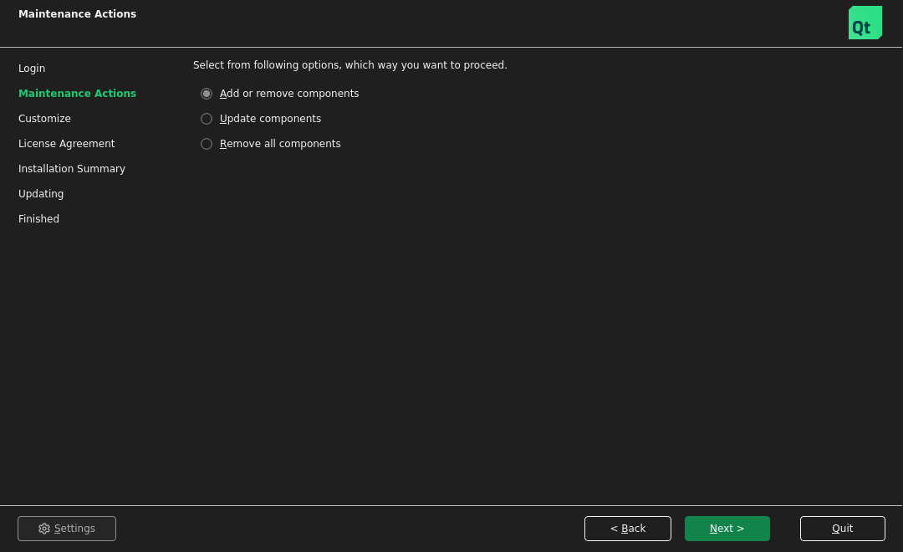

图 7：维护工具中的 Add or remove components 用于补装或移除组件，Update components 用于更新；若工具要求先更新自身，按其提示处理。

后续补装或更新组件时，也可给维护工具传入同样的镜像参数。在 Qt 安装目录中打开终端，按实际文件名执行；下面以 `MaintenanceTool` 为例：

Windows（PowerShell）：

```powershell
.\MaintenanceTool.exe --mirror https://mirrors.ustc.edu.cn/qtproject
```

Linux：

```bash
./MaintenanceTool --mirror https://mirrors.ustc.edu.cn/qtproject
```

维护工具同样支持 `--mirror`；需要镜像时，在启动命令中明确传入该参数。[Qt 官方：安装器与维护工具的镜像参数](https://doc.qt.io/qt-6/get-and-install-qt-cli.html#selecting-mirror-for-opensource)

**检查结果：** 能启动 Creator，并找到可用于桌面 C++ 工程的 Qt 6 Kit。随后通过小工程验证环境。

## 3. 获取源码并打开项目

### 3.1 从 GitHub 获取源码

源码仓库：[ecth0d7/qt-quick-robot-examples](https://github.com/ecth0d7/qt-quick-robot-examples)。

[下载 ZIP 压缩包](https://github.com/ecth0d7/qt-quick-robot-examples/archive/refs/heads/main.zip)，或按下面的步骤操作。

仓库包含两个独立示例和本文，按下面任一种方式下载即可。

**方式一：下载 ZIP**

1. 打开上面的 GitHub 仓库地址。
2. 点击 **Code → Download ZIP**。
3. 解压压缩包，进入解压后的仓库根目录，不要直接在压缩包内打开工程。

**方式二：使用 Git**

已安装 Git 时，在准备保存源码的目录打开终端，执行：

```bash
git clone https://github.com/ecth0d7/qt-quick-robot-examples.git
cd qt-quick-robot-examples
```

目录结构如下：

```text
qt-quick-robot-examples/
├── README.md
├── Qt入门教程.md
├── images/                  本文配图
└── qt_classroom/
    ├── 01_hello/
    │   ├── CMakeLists.txt
    │   ├── main.cpp
    │   ├── main.qml
    │   └── resources.qrc
    └── 02_robot_panel/
        ├── CMakeLists.txt
        ├── RobotState.h
        ├── RobotState.cpp
        ├── main.cpp
        ├── main.qml
        ├── RobotPanel.qml
        ├── RobotPanelForm.ui.qml
        ├── resources.qrc
        ├── DesignerPreview.qml
        └── RobotPanel.qmlproject
```

文中的工程路径均相对于仓库根目录；第 5、6 章源码标题中的 `01_hello/` 和 `02_robot_panel/` 相对于 `qt_classroom/`。第 5.2、6.1 节的第一组构建命令分别从仓库根目录的新终端执行；如果上一组命令已经进入某个示例目录，先回到仓库根目录。第 2 章安装器命令则在安装器所在目录执行。

通过 ZIP 下载时，目录名可能带有 `-main` 后缀；进入实际解压目录即可，内部相对路径不变。只复制单个 `.qml` 文件无法获得完整 C++ 工程，应下载整个仓库。

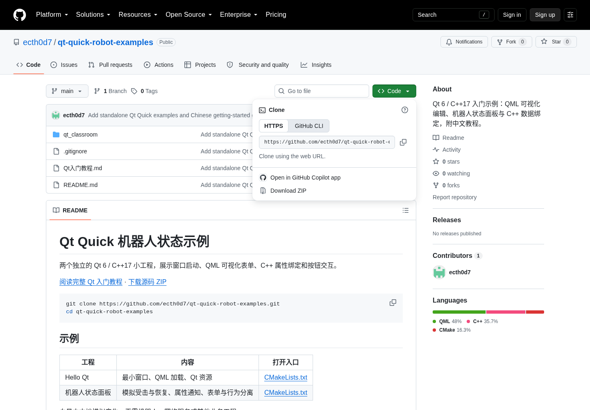

图 8：Code 菜单中可以复制 HTTPS 克隆地址，也可以点击 Download ZIP 下载完整源码。

### 3.2 打开完整工程

1. 启动 Qt Creator。
2. 在欢迎页或“文件”菜单选择 **Open Project / 打开项目**，部分版本显示“打开文件或项目”。
3. 进入 `qt_classroom/01_hello/`，选择 **`CMakeLists.txt`**。
4. 在配置页面选择上一章准备好的桌面 Qt 6 Kit，使用 Debug 配置。
5. 确认构建目录，点击 **Configure Project / 配置项目**，等待 CMake 完成。

这里要打开工程配置文件，单独打开 `main.cpp` 只能编辑代码，不能代替完整的构建配置。[Qt 官方：打开项目](https://doc.qt.io/qtcreator/creator-project-opening.html)

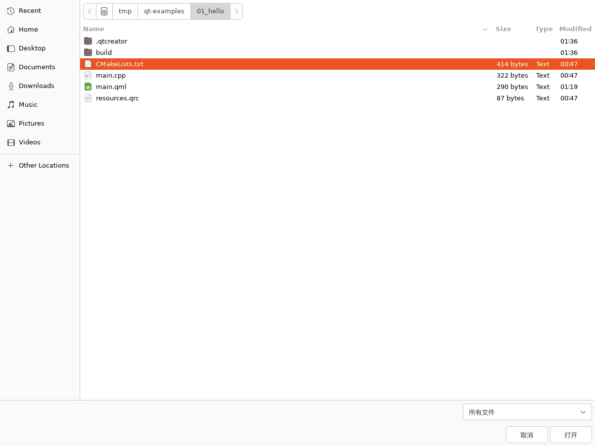

图 9：打开项目时选择 `01_hello/CMakeLists.txt`，然后点击右下角的打开按钮。图中的 `build` 和 `.qtcreator` 是本机配置后产生的目录。

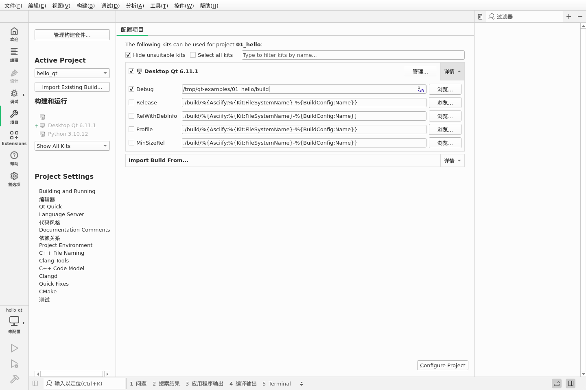

图 10：勾选桌面 Qt Kit 和 Debug，确认构建目录，再点击右下角 Configure Project。

### 3.3 认识 Creator 的几个区域

| 区域 | 用来做什么 |
| --- | --- |
| 项目文件树 | 找到 C++、QML 和工程配置文件 |
| 中央编辑区 | 阅读和修改当前文件 |
| Projects / 项目设置 | 检查构建与运行配置 |
| Build / 构建操作 | 根据源码生成程序 |
| Run / 运行操作 | 启动当前选择的程序 |
| Compile Output / 编译输出 | 查看配置、编译和链接过程 |
| Application Output / 应用程序输出 | 查看程序运行日志 |
| Issues / 问题 | 集中查看错误和警告 |

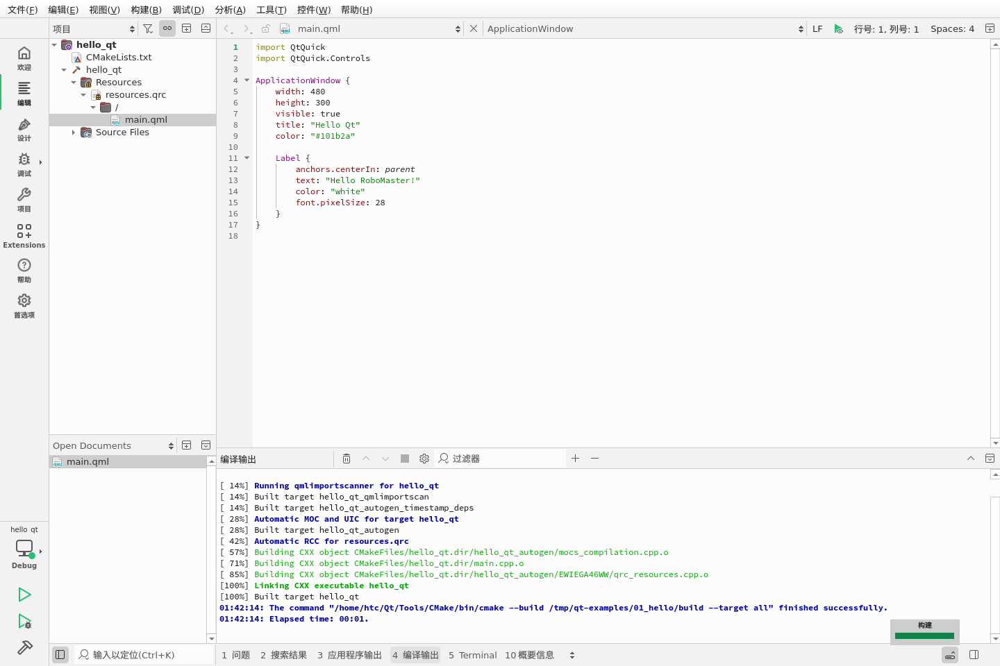

图 11：左侧为项目文件树，中间为源码，底部为编译输出；左下方的绿色三角形用于运行，锤子图标用于构建。输出中的 `Built target hello_qt` 表示目标已构建完成。

### 3.4 构建并运行

先执行“构建”，成功后执行“运行”。预期看到深色窗口和 `Hello RoboMaster!`。

第一次先不修改代码。能成功运行，说明 Qt 库、编译器和工程配置已经基本配合起来。若失败，先从问题面板和编译输出找到第一条有效错误。


图 12：`hello_qt` 实际运行结果。

**检查结果：** 工程配置成功，运行后显示 Hello 窗口。

## 4. 如何可视化编辑界面

本章先体验设计工具。使用已经提供好的工程二，不需要立即理解它的 C++ 代码。

### 4.1 选对入口

| 目的 | 打开什么 |
| --- | --- |
| 构建并运行完整机器人面板 | `qt_classroom/02_robot_panel/CMakeLists.txt` |
| 打开界面设计工程 | `qt_classroom/02_robot_panel/RobotPanel.qmlproject` |
| 修改面板外观 | 设计工程中的 `RobotPanelForm.ui.qml` |

在 Qt Creator 的 Qt Quick Designer，或 Qt Design Studio 中打开设计工程，再选择 `RobotPanelForm.ui.qml` 进入 **Design / 设计** 模式。`.ui.qml` 用于支持可视化编辑的表单。[Qt 官方：UI 文件](https://doc.qt.io/qtcreator/creator-quick-ui-forms.html)

如果 Design / 设计为灰色，或没有设计入口，先按下面的流程检查当前文件和 Qt Quick Designer 插件。

打开 `.qmlproject` 后，可以在项目树找到 `RobotPanelForm.ui.qml`。选中它并点击左侧“设计”，即可进入下图所示的编辑界面。

#### 4.1.1 Design / 设计为灰色时：先检查当前文件

Design 是否可用与当前打开的文件有关。先在项目树中双击 `RobotPanelForm.ui.qml`，让它成为中央编辑区的当前文件，再检查左侧“设计”。只停留在 `CMakeLists.txt`、`.cpp` 或 `.qmlproject` 的文本页面，并不代表已经打开可视化表单。

如果选中 `.ui.qml` 后仍然灰色，或根本没有设计入口，再按下面的流程启用插件。

#### 4.1.2 从“帮助 → 关于插件”启用 QML 设计器

1. 保存正在编辑的文件。
2. 在 Qt Creator 顶部菜单点击 **帮助（Help）→ 关于插件（About Plugins）**。macOS 的入口通常在 **Qt Creator → About Plugins**。

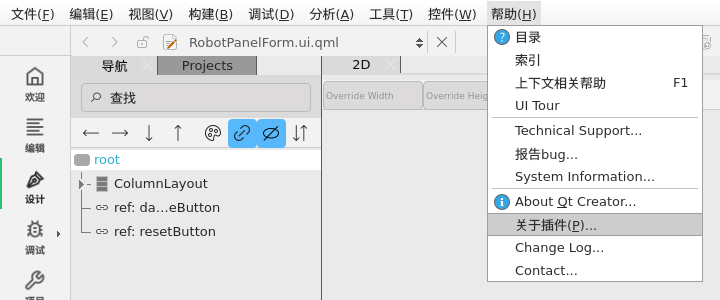

图 12A：点击“关于插件”，进入插件管理窗口。

3. 在顶部过滤框输入 **`qml`**，查找 **QmlDesigner / Qt Quick Designer**。如果没有结果，清空搜索框，改搜 **`designer`** 或 **`Qt Quick`**。本机 Qt Creator 19.0.2 显示的名称是 **Qt Quick Designer (deprecated)**，搜索 `designer` 可以找到它；`deprecated` 表示该功能已被标记为弃用，本机版本仍可启用。
4. 勾选该行 **载入（Load）** 列的复选框。若弹出依赖插件提示，确认一并启用。**用于 QML 表单的是 Qt Quick Designer；Qt Widgets Designer 对应的是另一种 `.ui` 文件。** QML Preview、QML Profiler 等也不是这个可视化编辑器，无需把所有含 QML 的插件都勾上。

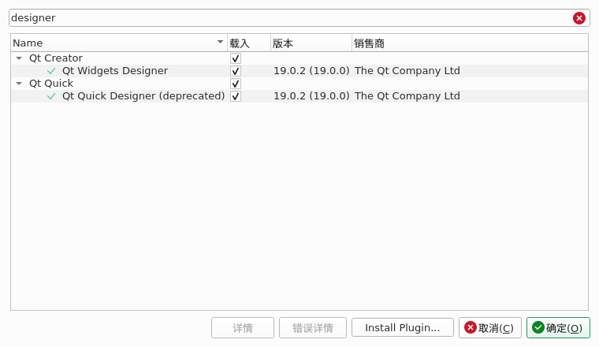

图 12B：Qt Quick 分组下的 Qt Quick Designer 已勾选“载入”。插件的显示名称与内部名称 `QmlDesigner` 可能不同。

5. 点击 **确定（OK）**，在提示中选择 **Restart Now / 立即重启**。如果选择 Later / 稍后，需要自行完全退出并重新启动 Qt Creator，插件设置才会生效。

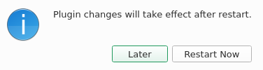

图 12C：点击 Restart Now 重启工具。仅关闭并重新打开 QML 文件不能代替重启。

6. 重启后打开 `qt_classroom/02_robot_panel/RobotPanel.qmlproject`，再双击 `RobotPanelForm.ui.qml`，点击左侧 **Design / 设计**。
7. 确认能看到对象树、2D 画布和属性面板，再进行后面的圆角修改操作。

以上插件管理入口、载入选项和重启要求可参见 [Qt 官方：启用与禁用插件](https://doc.qt.io/qtcreator/creator-how-to-enable-plugins.html)。

#### 4.1.3 仍然打不开时，按现象处理

| 现象 | 处理方式 |
| --- | --- |
| 搜索 `qml` 没找到设计器 | 改搜 `designer`，查找 Qt Quick Designer；不要仅凭搜索词判断插件不存在 |
| 已勾选，但设计仍为灰色 | 完全重启 Creator，并确认当前文件是 `RobotPanelForm.ui.qml` |
| 插件显示加载错误 | 选中插件查看“错误详情（Error Details）”和依赖信息；按错误修复对应 Creator 安装或依赖 |
| 所有搜索词都找不到 Qt Quick Designer | 当前 Creator 安装可能未提供该插件，可使用下面的 Qt Design Studio 入口 |
| 打开表单却启动外部工具 | 检查“首选项 → Qt Quick → QML/JS Editing”中的 `Open .ui.qml files with` 设置，确认使用的是哪一个编辑器 |
| 可以进入设计模式，但画布报错 | 检查缺失的 QML 模块、导入路径和表单语法；这属于表单加载问题，继续勾选插件通常无效 |

**程序能运行，设计器却报 `QML module not found` 时：**

本次使用全新 Creator 配置复现时，启用插件后遇到了 `QtQuick.Controls`、`QtQuick.Layouts` 的识别错误。随后重启工具可以进入画布，但一度出现背景不完整；重置代码模型并重新进入设计模式后恢复了正常显示。建议按以下顺序排查：

1. 在“项目”设置中确认 `.qmlproject` 使用正确的桌面 Qt Kit；先确认完整 CMake 工程能构建并运行。
2. 切到编辑模式，点击 **工具（Tools）→ QML/JS → 重置代码模型（Reset Code Model）**。
3. 等待底部的 QML 扫描和解析进度结束，再重新打开 `RobotPanelForm.ui.qml`，切回“设计”。必要时关闭并重新打开项目或完全重启 Creator。
4. 如果仍然报错，查看错误中的导入路径是否属于当前 Kit 的 Qt，检查安装是否包含对应模块。实际缺失的模块需要补装，重置索引不能代替安装。

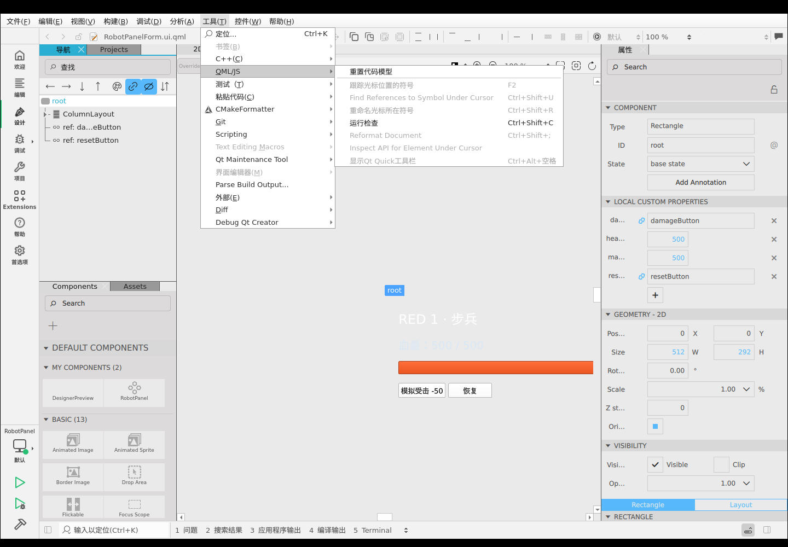

图 12D：本机复现时使用的重置入口，用于让 Creator 重新识别 QML 类型。

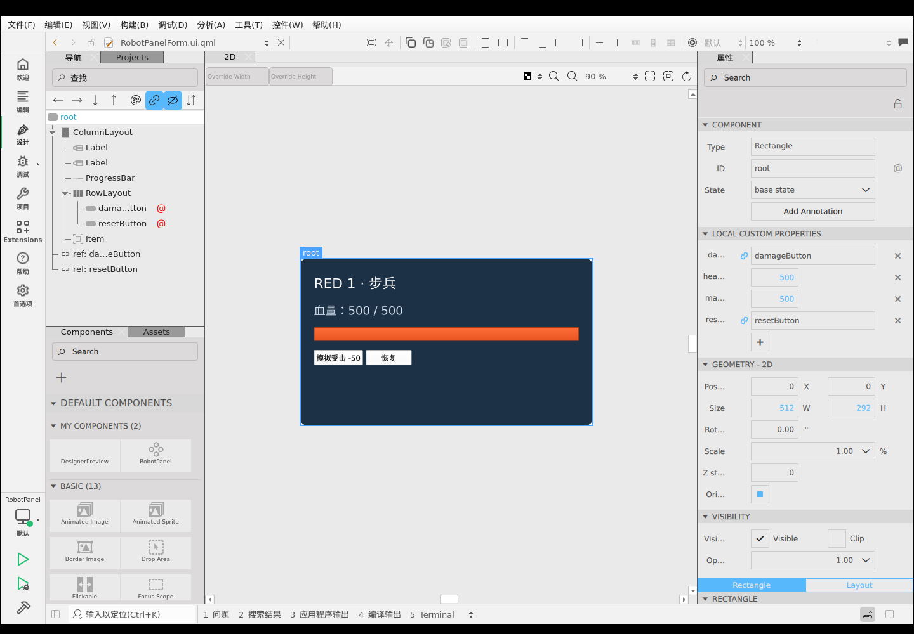

图 12E：处理后可看到完整背景、血量、按钮和对象树；随后已验证属性面板修改圆角能写回源码。

这是本次环境的实测处理过程，不代表所有模块错误的原因都相同。Qt 官方也将构建后重置代码模型列为模块识别错误的排查方法：[Qt 官方：重置代码模型](https://doc.qt.io/qtcreator/creator-reference-js-and-qml-error-codes.html#resetting-the-code-model)。

#### 4.1.4 其他可视化入口

**从完整 CMake 工程进入：** 也可以打开 `qt_classroom/02_robot_panel/CMakeLists.txt`，配置桌面 Kit 后，在项目树或资源清单中找到 `RobotPanelForm.ui.qml`，打开它并切换到“设计”。本例仍建议先用 `.qmlproject` 熟悉独立表单编辑。

**使用 Qt Design Studio：** 安装并启动 Qt Design Studio，选择“打开项目”，打开同一个 `qt_classroom/02_robot_panel/RobotPanel.qmlproject`，再选择 `RobotPanelForm.ui.qml` 编辑。完整 C++ 程序仍通过 Qt Creator 的 CMake 工程构建和运行。

如果已经安装 Qt Design Studio，还可以在 Creator 的项目树中右键点击 `.ui.qml`，选择 **Open With / 打开方式 → Qt Design Studio**；部分版本也可在 **首选项（Preferences）→ Qt Quick → QML/JS Editing → Open .ui.qml files with** 中选择它。只有安装了对应工具，该入口才能正常使用。[Qt 官方：在 Qt Design Studio 中打开 UI 文件](https://doc.qt.io/qtcreator/creator-how-to-open-files-in-qds.html)、[Qt 官方：UI 文件与打开方式](https://doc.qt.io/qtcreator/creator-quick-ui-forms.html)

**检查结果：** 能选中根矩形，并在属性面板中找到颜色、尺寸和圆角等属性。正式运行程序、预览窗口和可视化编辑是不同操作，单纯运行 `DesignerPreview.qml` 不等于进入可视化编辑器。

### 4.2 认识设计视图

| 区域 | 操作方式 |
| --- | --- |
| Navigator / 对象树 | 选择窗口中的矩形、文字和按钮 |
| 2D / 画布 | 查看布局和选中控件 |
| Properties / 属性 | 修改文字、颜色、圆角、尺寸等 |
| Components / 组件库 | 查找并添加可用控件 |

可以在对象树或画布选中组件，再修改属性面板中的值。遇到不容易点选的内部控件，优先使用对象树。[Qt 官方：创建和编辑组件实例](https://doc.qt.io/qtcreator/quick-component-instances.html)

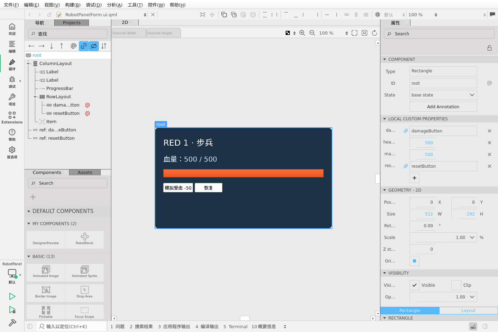

图 13：左上为对象树，左下为 Components 组件库，中间为 2D 画布，右侧为属性面板。此时选中的是根对象 `root`。

### 4.3 不写代码，先改一次外观

1. 在对象树选择表单根 `Rectangle`。
2. 在属性面板找到 `radius`，把圆角从 `12` 改为 `24`。
3. 保存，观察画布变化。
4. 切到代码视图，找到 `radius: 24`，确认设计操作已经写入源码。
5. 打开或切回 `02_robot_panel/CMakeLists.txt` 对应的完整工程，构建并运行 `robot_panel`。

预期结果：设计视图和正式程序都显示新的圆角。第一次先改圆角、颜色、字体或间距；面板实际宽度由外层窗口布局决定，改默认 `width` 未必能看出变化。

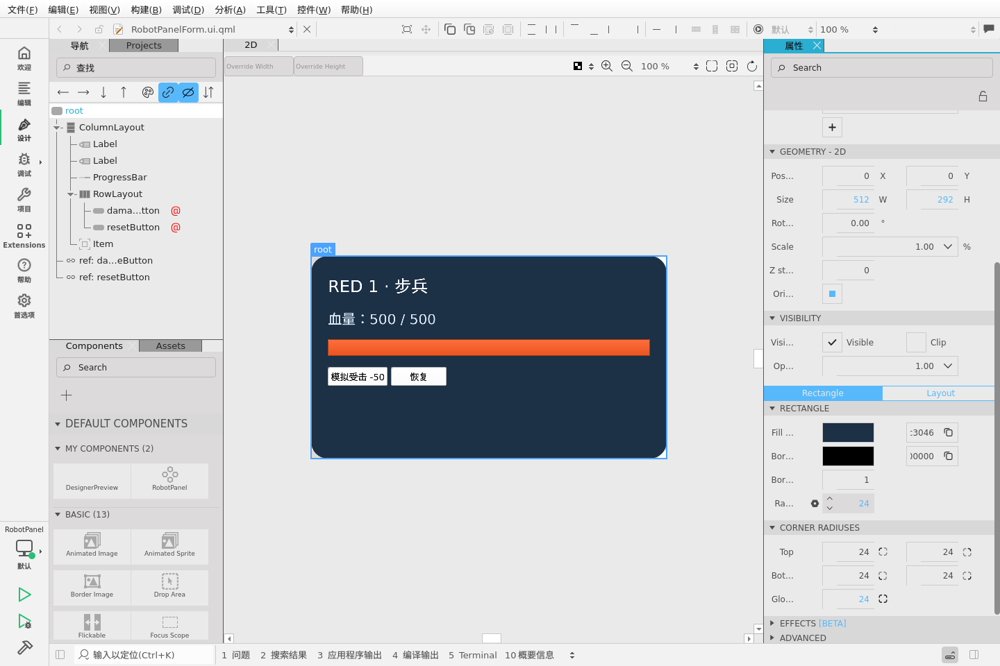

图 14：在右侧属性面板向下滚动到 Rectangle 区域，将 Radius 改为 `24`。面板较窄时标签可能缩写为 `Ra...`；画布中的圆角会同步变化。

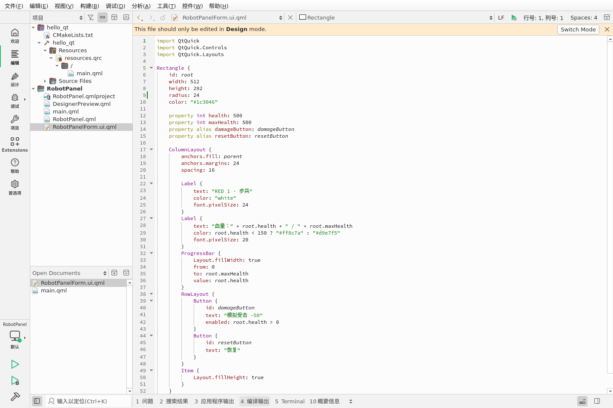

图 15：保存后切回代码视图，确认 `radius: 24` 已写入表单。

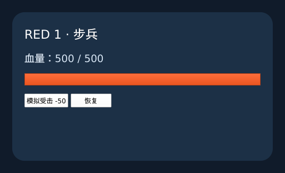

图 16：重新构建并启动 C++ 应用后，正式面板也显示更大的圆角。仓库默认源码仍为 `radius: 12`，以上截图展示的是执行本节修改后的结果。

### 4.4 只看正在修改的面板

这个小工程只有一个面板，打开 `RobotPanelForm.ui.qml` 就能专注编辑它。以后界面变多时，也可以单独打开目标表单，或使用专门的预览入口，不必把整个应用的所有界面都放在同一个画布上编辑。

### 4.5 分清设计预览和正式程序

| 项目 | 设计预览 | 正式运行 |
| --- | --- | --- |
| 入口 | `DesignerPreview.qml` | C++ 加载 `main.qml` |
| 界面 | `RobotPanelForm` | 行为组件使用同一份 Form |
| 血量来源 | 预览文件写入的 350 | C++ 对象初始为 500 |
| 按钮 | 展示外观，没有业务点击逻辑 | 可以受击和恢复 |
| 后端 | 不需要 C++ 对象 | 需要 C++ 对象 |

直接在设计器打开表单时可能看到默认 500；运行专用预览文件时显示 350。这些预览数字用来帮助排版，不会修改正式后端数据。

本例的完整应用把 QML 放入 `.qrc` 资源中。修改后要 **保存 → 关闭旧程序 → 构建 → 重新运行**。如果同时打开多个工程，检查当前活动工程和运行目标，确保运行的是 `robot_panel`。

**检查结果：** 保存并构建后，正式程序显示修改后的外观。

到这里，安装和工具操作已经完成。下面从最小工程开始解释代码，再逐步学习属性绑定、C++ 数据和内存管理。

## 5. 示例一：第一个窗口的完整源码

工程入口：[01_hello/CMakeLists.txt](qt_classroom/01_hello/CMakeLists.txt)。仓库中已包含这四个文件；下面列出完整内容，方便对照阅读。

```text
01_hello/
├── CMakeLists.txt
├── main.cpp
├── main.qml
└── resources.qrc
```

### `01_hello/CMakeLists.txt`

```cmake
cmake_minimum_required(VERSION 3.21)
project(hello_qt LANGUAGES CXX)

set(CMAKE_CXX_STANDARD 17)
set(CMAKE_CXX_STANDARD_REQUIRED ON)
find_package(Qt6 6.5 REQUIRED COMPONENTS Core Gui Qml Quick QuickControls2)
qt_standard_project_setup()
set(CMAKE_AUTORCC ON)

qt_add_executable(hello_qt main.cpp resources.qrc)
target_link_libraries(hello_qt PRIVATE
    Qt6::Core Qt6::Gui Qt6::Qml Qt6::Quick Qt6::QuickControls2)
```

### `01_hello/main.cpp`

```cpp
#include <QGuiApplication>
#include <QQmlApplicationEngine>
#include <QUrl>

int main(int argc, char *argv[])
{
    QGuiApplication app(argc, argv);
    QQmlApplicationEngine engine;
    engine.load(QUrl(QStringLiteral("qrc:/main.qml")));
    if (engine.rootObjects().isEmpty())
        return 1;
    return app.exec();
}
```

### `01_hello/main.qml`

```qml
import QtQuick
import QtQuick.Controls

ApplicationWindow {
    width: 480
    height: 300
    visible: true
    title: "Hello Qt"
    color: "#101b2a"

    Label {
        anchors.centerIn: parent
        text: "Hello RoboMaster!"
        color: "white"
        font.pixelSize: 28
    }
}
```

### `01_hello/resources.qrc`

```xml
<RCC>
    <qresource prefix="/">
        <file>main.qml</file>
    </qresource>
</RCC>
```

### 5.1 用 Qt Creator 运行

1. 打开 `qt_classroom/01_hello/CMakeLists.txt`。
2. 选择桌面 Qt Kit 和 Debug 配置，等待 CMake 配置完成。
3. 执行“构建”，然后“运行”。
4. 查看“应用程序输出”和“Issues/问题”，记录第一条有效错误。

预期结果：一个深色窗口，中间显示 `Hello RoboMaster!`。

### 5.2 终端构建方式

以下命令从仓库根目录执行。Linux 下运行路径如下；Windows 可使用 Qt Creator 运行配置。

前提：终端的 CMake 查找环境已经能够找到所安装的 Qt。Qt Creator 选过 Kit，不代表外部终端也自动取得同样的环境。

```bash
cd qt_classroom/01_hello
cmake -S . -B build -DCMAKE_BUILD_TYPE=Debug
cmake --build build -j 4
./build/hello_qt
```

若提示找不到 Qt6，可先在 Creator 中按 5.1 操作。也可以把对应 Qt 的 `bin` 目录加入终端的 PATH，再在工程目录使用它提供的配置工具：

```bash
qt-cmake -S . -B build -DCMAKE_BUILD_TYPE=Debug
cmake --build build -j 4
./build/hello_qt
```

Qt 的安装位置按本机环境配置。`qt-cmake` 必须来自准备使用的那套桌面 Qt；若不在 PATH 中，可使用它的完整路径，并给包含空格的路径加引号。Linux 可用 `command -v qt-cmake`，PowerShell 可用 `Get-Command qt-cmake*` 检查实际调用位置。PowerShell 执行带引号的程序路径时，需要在前面加 `&`。

Qt Creator 的 Kit 不会自动修改外部终端的 PATH。切换 Qt 版本、编译器或 CMake 生成器时，使用新的构建目录，例如把上述命令中的 `build` 全部改成 `build-new`，避免旧的 CMakeCache 继续引用原工具链。

### 5.3 逐步解释启动过程

| 语句或文件 | 作用 |
| --- | --- |
| `QGuiApplication app(...)` | 建立 GUI 应用环境 |
| `QQmlApplicationEngine engine` | 创建 QML 引擎 |
| `engine.load(...)` | 加载界面，并创建 QML 对象 |
| `rootObjects().isEmpty()` | 检查是否成功创建根对象 |
| `app.exec()` | 进入事件循环，处理输入、计时器等事件 |
| `resources.qrc` | 把 `main.qml` 纳入资源构建 |

`qrc:/main.qml` 是 Qt 资源 URL，不是电脑根目录的文件路径。这里界面随程序构建；保存 QML 后，要重新构建并重新运行。

CMake 中，`find_package` 查找 Qt，`qt_add_executable` 声明要生成的程序，`target_link_libraries` 指定依赖。`qt_standard_project_setup()` 开启包括 AUTOMOC 在内的常用设置；`CMAKE_AUTORCC` 让构建处理 `.qrc` 清单。

### 5.4 修改窗口标题与文字

修改窗口标题和问候文字，然后构建并运行。确认修改的源码文件、构建目录和实际运行的程序路径。

**预期结果：** 新启动的窗口显示修改后的标题和文字。

## 6. 示例二：机器人状态面板的完整源码

这个工程独立于工程一，可以直接打开运行。它加入 C++ 状态对象和可视化表单，没有网络、插件动态库或大型工程依赖。

工程入口：[02_robot_panel/CMakeLists.txt](qt_classroom/02_robot_panel/CMakeLists.txt)。仓库中已包含这十个文件，下面给出完整内容，不需要从其他项目补代码。

```text
02_robot_panel/
├── CMakeLists.txt
├── RobotState.h              声明血量属性、操作和通知
├── RobotState.cpp            血量规则的实现
├── main.cpp                  创建后端并交给 QML
├── main.qml                  正式窗口
├── RobotPanelForm.ui.qml     外观与布局
├── RobotPanel.qml            数据绑定与点击处理
├── resources.qrc             正式界面的资源清单
├── DesignerPreview.qml       静态设计预览
└── RobotPanel.qmlproject     设计工具入口
```

### `02_robot_panel/CMakeLists.txt`

```cmake
cmake_minimum_required(VERSION 3.21)
project(robot_panel LANGUAGES CXX)

set(CMAKE_CXX_STANDARD 17)
set(CMAKE_CXX_STANDARD_REQUIRED ON)
find_package(Qt6 6.5 REQUIRED COMPONENTS Core Gui Qml Quick QuickControls2)
qt_standard_project_setup()
set(CMAKE_AUTORCC ON)

qt_add_executable(robot_panel
    main.cpp
    RobotState.h
    RobotState.cpp
    resources.qrc
)
target_link_libraries(robot_panel PRIVATE
    Qt6::Core Qt6::Gui Qt6::Qml Qt6::Quick Qt6::QuickControls2)
```

### `02_robot_panel/RobotState.h`

```cpp
#pragma once

#include <QObject>

class RobotState final : public QObject
{
    Q_OBJECT
    Q_PROPERTY(int health READ health NOTIFY healthChanged)
    Q_PROPERTY(int maxHealth READ maxHealth CONSTANT)

public:
    explicit RobotState(QObject *parent = nullptr);

    int health() const;
    int maxHealth() const;
    Q_INVOKABLE void damage(int amount);
    Q_INVOKABLE void reset();

signals:
    void healthChanged();

private:
    void setHealth(int value);
    int m_health = 500;
};
```

### `02_robot_panel/RobotState.cpp`

```cpp
#include "RobotState.h"
#include <algorithm>

RobotState::RobotState(QObject *parent) : QObject(parent) {}

int RobotState::health() const
{
    return m_health;
}

int RobotState::maxHealth() const
{
    return 500;
}

void RobotState::damage(int amount)
{
    if (amount <= 0)
        return;
    setHealth(m_health - std::min(amount, m_health));
}

void RobotState::reset()
{
    setHealth(maxHealth());
}

void RobotState::setHealth(int value)
{
    const int next = std::clamp(value, 0, maxHealth());
    if (m_health == next)
        return;
    m_health = next;
    emit healthChanged();
}
```

### `02_robot_panel/main.cpp`

```cpp
#include "RobotState.h"
#include <QGuiApplication>
#include <QQmlApplicationEngine>
#include <QUrl>
#include <QVariant>

int main(int argc, char *argv[])
{
    QGuiApplication app(argc, argv);
    RobotState robot; // 先创建后端，保证它比 QML 引擎更晚销毁。
    QQmlApplicationEngine engine;
    engine.setInitialProperties({{"backend", QVariant::fromValue(&robot)}});
    engine.load(QUrl(QStringLiteral("qrc:/main.qml")));
    if (engine.rootObjects().isEmpty())
        return 1;
    return app.exec();
}
```

### `02_robot_panel/main.qml`

```qml
import QtQuick
import QtQuick.Controls

ApplicationWindow {
    id: window
    required property var backend
    width: 560
    height: 340
    minimumWidth: 400
    minimumHeight: 300
    visible: true
    title: "机器人状态面板"
    color: "#101b2a"

    RobotPanel {
        anchors.fill: parent
        anchors.margins: 24
        backend: window.backend
    }
}
```

### `02_robot_panel/RobotPanelForm.ui.qml`

```qml
import QtQuick
import QtQuick.Controls
import QtQuick.Layouts

Rectangle {
    id: root
    width: 512
    height: 292
    radius: 12
    color: "#1c3046"

    property int health: 500
    property int maxHealth: 500
    property alias damageButton: damageButton
    property alias resetButton: resetButton

    ColumnLayout {
        anchors.fill: parent
        anchors.margins: 24
        spacing: 16

        Label {
            text: "RED 1 · 步兵"
            color: "white"
            font.pixelSize: 24
        }
        Label {
            text: "血量：" + root.health + " / " + root.maxHealth
            color: root.health < 150 ? "#ff8c7a" : "#d9e7f5"
            font.pixelSize: 20
        }
        ProgressBar {
            Layout.fillWidth: true
            from: 0
            to: root.maxHealth
            value: root.health
        }
        RowLayout {
            Button {
                id: damageButton
                text: "模拟受击 -50"
                enabled: root.health > 0
            }
            Button {
                id: resetButton
                text: "恢复"
            }
        }
        Item {
            Layout.fillHeight: true
        }
    }
}
```

### `02_robot_panel/RobotPanel.qml`

```qml
import QtQuick

RobotPanelForm {
    id: panel
    required property var backend
    health: panel.backend.health
    maxHealth: panel.backend.maxHealth

    Connections {
        target: panel.damageButton
        function onClicked() {
            panel.backend.damage(50);
        }
    }
    Connections {
        target: panel.resetButton
        function onClicked() {
            panel.backend.reset();
        }
    }
}
```

### `02_robot_panel/resources.qrc`

```xml
<RCC>
    <qresource prefix="/">
        <file>main.qml</file>
        <file>RobotPanel.qml</file>
        <file>RobotPanelForm.ui.qml</file>
    </qresource>
</RCC>
```

### `02_robot_panel/DesignerPreview.qml`

```qml
import QtQuick
import QtQuick.Controls

ApplicationWindow {
    width: 560
    height: 340
    visible: true
    title: "设计预览：静态示例数据"
    color: "#101b2a"

    RobotPanelForm {
        anchors.fill: parent
        anchors.margins: 24
        health: 350
        maxHealth: 500
    }
}
```

### `02_robot_panel/RobotPanel.qmlproject`

```qml
import QmlProject 1.1

Project {
    mainFile: "DesignerPreview.qml"
    mainUiFile: "RobotPanelForm.ui.qml"
    QmlFiles { directory: "." }
    qt6Project: true
}
```

### 6.1 构建与运行

在 Qt Creator 中打开 `qt_classroom/02_robot_panel/CMakeLists.txt`，选择桌面 Kit，构建并运行 `robot_panel`。

也可在已经配置 Qt 查找环境的终端中，从仓库根目录执行：

```bash
cd qt_classroom/02_robot_panel
cmake -S . -B build -DCMAKE_BUILD_TYPE=Debug
cmake --build build -j 4
./build/robot_panel
```

与工程一相同，需要时可用 `qt-cmake` 替代第一条配置命令中的 `cmake`。

**预期结果：** 初始血量为 500；每次受击减少 50；低于 150 时文字变色；最低为 0，受击按钮随后禁用；点击恢复后回到 500。

## 7. 一次点击如何更新界面

一次受击操作的数据流如下，对应源码见上一章。


```mermaid
flowchart LR
    A[点击受击按钮] --> B[RobotPanel.qml 的 Connections]
    B --> C[调用 RobotState.damage]
    C --> D[更新 m_health]
    D --> E[发出 healthChanged]
    E --> F[重新读取绑定的 health]
    F --> G[文字和进度条更新]
```

### 7.1 QML 属性与绑定

表单中的 `property int health: 500` 定义可变化的属性；`value: root.health` 让进度条依赖这个属性。属性变化时，绑定表达式会重新计算。[Qt 官方：属性绑定](https://doc.qt.io/qt-6/qtqml-syntax-propertybinding.html)

`id: root` 在当前组件作用域内标识对象；它不是全局变量。`root.health < 150 ? ... : ...` 是根据血量选择颜色的条件表达式。

本例由 C++ 对象管理血量数据。因此点击时调用 `backend.damage(50)`，由 C++ 修改血量。不要改成 `panel.health = 100`：这会覆盖 `health: panel.backend.health` 的绑定，界面可能不再跟随后端。

点击受击按钮后，文字和进度条随血量变化自动更新，无需分别编写刷新代码。

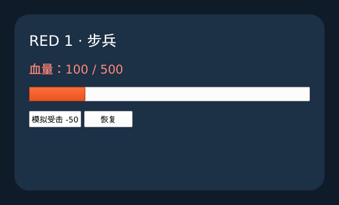

图 17：在圆角修改后的程序中连续点击八次受击，血量从 500 变为 100。文字颜色和进度条长度随同一份 C++ 状态更新。

### 7.2 `Q_PROPERTY` 与更新通知

`Q_PROPERTY(int health READ health NOTIFY healthChanged)` 把 C++ 的血量公开为 Qt 属性。`READ` 指定读取函数，`NOTIFY` 指定变化通知。`maxHealth` 使用 `CONSTANT`，表示该属性在对象生命周期内不变化。

`Q_INVOKABLE` 允许 QML 调用 `damage()` 和 `reset()`。`Q_OBJECT` 配合构建时生成的元对象代码支持这些机制。[Qt 官方：暴露 C++ 属性与方法](https://doc.qt.io/qt-6/qtqml-cppintegration-exposecppattributes.html)

`setHealth()` 先限制范围，再判断值是否真的改变，最后修改成员并发出 `healthChanged()`。这样既维护状态规则，也避免无意义的重复通知。

**验证更新通知：** 临时注释 `emit healthChanged()`，构建运行，观察点击后界面不刷新。用 C++ 断点查看 `m_health`，确认“数据没变化”和“界面没收到通知”是两个问题。验证完成后恢复该行。

### 7.3 C++ 对象怎样到达 QML

`main.cpp` 中的 `engine.setInitialProperties(...)` 在加载根对象前提供 `backend`。`main.qml` 使用 `required property var backend` 接收它，再传给 `RobotPanel`。

`required` 要求创建组件时提供该属性。正式窗口必须由带后端的 C++ 程序加载，单独运行它可能因缺少 `backend` 失败；设计预览有自己的入口。

### 7.4 表单与行为为什么分开

| 文件 | 放什么 | 本例内容 |
| --- | --- | --- |
| `RobotPanelForm.ui.qml` | 外观、布局、显示属性 | 文字、颜色、进度条、按钮 |
| `RobotPanel.qml` | 绑定和交互 | 连接点击信号，调用后端 |
| `RobotState.cpp` | 数据规则 | 血量范围、受击、恢复 |

表单通过 `property alias damageButton: damageButton` 暴露内部按钮，包装器再用 `Connections` 处理它的点击信号。别名让外部能够访问按钮，但不需要知道其内部布局。

`.ui.qml` 有设计工具的语法限制，应保留声明式表单；函数、点击处理和计时器等逻辑放到普通 QML 或 C++ 中。[Qt 官方：UI 文件约束](https://doc.qt.io/qtcreator/creator-quick-ui-forms.html)

### 7.5 布局怎样适应窗口

`ColumnLayout` 负责纵向排列，`RowLayout` 负责横向排列。外层布局用 `anchors.fill` 占据面板内部空间；布局管理的子控件用 `Layout.fillWidth`、`Layout.fillHeight` 等属性安排尺寸。

同一个由 Layout 管理的子控件，不要又用 anchors 强行控制其几何尺寸。需要建议尺寸时使用 `Layout.preferredWidth`、`Layout.preferredHeight`。[Qt 官方：布局说明](https://doc.qt.io/qt-6/qtquicklayouts-overview.html)

## 8. 内存与线程管理

### 8.1 对象寿命与所有权

工程二的 `robot` 和 `engine` 都是局部对象。`robot` 先构造，`engine` 后构造；退出时顺序相反，所以 QML 引擎结束后，后端才释放。传入 `&robot` 是让 QML 使用现有对象，不要求在这里动态分配一份新对象。

QObject 还支持父子所有权：父对象销毁时会销毁其子对象。对需要动态创建的 QObject，可以明确交给父对象管理。[Qt 官方：对象树与所有权](https://doc.qt.io/qt-6/objecttrees.html)

| 情况 | 建议 |
| --- | --- |
| 能直接放在作用域或类成员中的数据 | 优先值语义，随作用域或所属对象释放 |
| 独占的非 QObject 动态资源 | 使用 RAII 或 `std::unique_ptr` |
| 由 QObject 父对象管理的堆对象 | 不再让另一个独立拥有者重复负责释放 |
| 只借用的对象指针 | 确保对象寿命覆盖使用期 |

本例通过局部对象管理生命周期，无需额外使用 `new`。设计对象关系时，应明确创建者、拥有者和使用者。

### 8.2 不阻塞事件循环

本例受击操作很短，直接在主线程完成即可。以后接入网络、图像或 AI 时，不要在按钮回调中执行长期等待或耗时推理。

GUI 操作留在主线程；耗时任务采用异步方式或工作线程，完成后再交付结果。QObject 的线程归属和事件循环需要配合。[Qt 官方：线程与 QObject](https://doc.qt.io/qt-6/threads-qobject.html)

`QTimer` 不会自动创建工作线程；把耗时推理放进主线程的定时回调仍然会卡住界面。后台任务退出时要先停止任务并等待线程结束，再释放被使用的对象。

## 9. 从小工程理解模块化

本例划分出三种职责：状态规则、界面行为、界面外观。它们可以分别阅读和修改，但**本例没有实现动态插件系统**。

接入设备时，可以按照下面的关系组织数据流：

```text
设备或模拟数据 → 数据解析 → 状态对象或列表模型 → QML 界面
```

如果机器人数量增加，可用 `ListView` / `GridView` 与模型配合，让一份 delegate 模板显示多条记录。C++ 列表通常采用 `QAbstractListModel`：已有记录变化要发 `dataChanged`；插入、删除记录分别配对使用 begin/end 通知。[Qt 官方：QAbstractListModel](https://doc.qt.io/qt-6/qabstractlistmodel.html)

后续实现插件时，需要明确数据接口、启动和停止方法、所有权、线程以及缓存上限。把文件分成几个文件夹只是代码组织的起点，不能自动获得插件隔离和生命周期管理。

## 10. 常见问题与调试方法

### 10.1 先按现象定位

| 现象 | 优先检查 |
| --- | --- |
| CMake 找不到 Qt6 | Creator 的 Kit 是否正确；外部终端是否配置了对应 Qt |
| 找不到 QtQuick 或 Controls | 是否安装对应模块，是否混用了另一套 Qt 环境 |
| 改界面没有效果 | 是否保存、重新构建并运行正确的可执行文件 |
| 新增 QML 组件后找不到类型 | 文件名是否正确；本例的 `.qrc` 是否加入了新文件 |
| Design / 设计为灰色 | 按 4.1.1～4.1.3 检查当前文件、Qt Quick Designer 的载入状态和重启情况 |
| 设计视图报错 | 是否把函数或点击处理写进 `.ui.qml`，或缺少导入的模块 |
| required 属性未提供 | 是否误把正式 `main.qml` 当成无后端预览入口 |
| 血量变量变了，界面不更新 | 是否发出 `healthChanged`；是否覆盖了原绑定 |
| 布局异常 | 是否让 Layout 与 anchors 同时控制同一个子控件 |
| Q_OBJECT 相关链接错误 | 类文件是否加入目标、AUTOMOC 是否开启，同时检查函数是否有定义 |
| 窗口卡住 | 是否在主线程阻塞等待或执行长循环 |

**断点调试：** 在 `RobotState::damage()` 设置断点，以 Debug 启动，点击受击，查看 `amount` 和 `m_health`，再单步进入 `setHealth()`。观察先修改成员、再发出通知的执行顺序。

临时日志可以使用 C++ 的 `qDebug()`（需包含 `<QDebug>`），或普通 QML 事件处理中的 `console.log(...)`。先记录状态变化，避免高频刷屏。

### 10.2 Linux 启动失败：区分缺库、显示连接和渲染问题

若程序提示无法加载 `xcb` 平台插件，在示例目录执行以下命令，查看详细加载日志：

```bash
QT_DEBUG_PLUGINS=1 ./build/robot_panel
```

将程序路径替换为自己的实际构建结果。日志若明确指出某个 `.so` 不存在，安装对应发行版软件包；Qt 的 XCB 依赖清单见 [官方 Linux 依赖说明](https://doc.qt.io/qt-6/linux-requirements.html)。若提示 `could not connect to display`，先检查当前桌面会话或 SSH 图形转发；这与“缺少 libxcb-cursor0”不是同一个问题。

若已经能连接桌面，但明确报 OpenGL、RHI 或图形上下文创建失败，可以在当前命令临时使用软件渲染进行诊断：

```bash
QT_QUICK_BACKEND=software ./build/robot_panel
```

本例的文字、矩形和基础控件已在该模式下通过交互测试。软件渲染有功能限制，不应据此推断所有 Qt Quick 特效都兼容；也不要把它当作 `QML module not found` 的修复方法。[Qt 官方：软件渲染](https://doc.qt.io/qt-6/qtquick-visualcanvas-adaptations-software.html)

如果中文显示为方框，检查系统是否安装中文字体。Ubuntu / Debian 可安装 `fonts-noto-cjk`，然后重新启动程序。

### 10.3 Windows 运行路径与依赖

本文的 `./build/robot_panel` 是 Linux 示例。Windows 的可执行文件带 `.exe`，MSVC 等多配置生成器还可能放在 `build/Debug/` 或 `build/Release/`；以 Creator 的运行配置为准。终端使用多配置生成器时，构建命令需指定例如 `cmake --build build --config Debug`。

能在 Creator 中运行，但双击复制出去的 `.exe` 提示缺少 Qt DLL，属于部署依赖问题。发布程序时使用同一套 Qt 提供的 `windeployqt`，并让它扫描 QML 源码依赖；不要从另一套编译器或 Qt 版本中随意复制 DLL。[Qt 官方：Windows 部署](https://doc.qt.io/qt-6/windows-deployment.html)

### 10.4 什么时候考虑重装

先依次确认当前文件、Kit、插件载入、代码模型、构建缓存和系统依赖。只有安装文件缺失、维护工具报告组件损坏，或需要换一套明确兼容的工具组合时，再考虑修复或重装。

重装前备份源码和需要保留的设置；用 Maintenance Tool 管理 Qt 组件，保留源码目录。重新安装后重新检查 Kit，并使用新的构建目录。Creator 用户设置、项目个人设置和构建缓存可能独立于 Qt 安装目录，卸载开发库不等于它们都会被清空。本次检查使用了新的源码副本、构建目录和独立 Creator 配置，没有卸载现有 Qt，也没有把结果描述为全新系统安装验证。

详细实测项目、自动化检查命令、帖子交叉核对以及尚未验证的平台见 [复现检查报告](docs/REPRODUCIBILITY.md)。

## 11. 扩展练习与常见问答

### 扩展练习

1. 把每次受击改为 25，并同步按钮文字。说明两个修改分别在哪个文件。
2. 把低血量阈值改成最大血量的 30%，用比例表达式实现。
3. 把最大血量改成 800，确保初始值、恢复值和预览示例也合理；注意当前代码中初始值与 `maxHealth()` 分别在哪里定义。
4. 新增“治疗 +50”功能：在 C++ 中增加可调用方法，经过 `setHealth()` 限制上限；表单增加按钮和别名，行为文件连接信号。

完成后检查血量上下限、按钮行为、文字、进度条和窗口缩放，不只确认“能编译”。

### 常见问答

| 问题 | 说明 |
| --- | --- |
| 为什么 `.qmlproject` 能预览，但按钮不改血量？ | 本例预览只加载 Form，未创建 C++ 后端与行为包装器 |
| 为什么不用手动更新文字和进度条？ | 它们通过属性绑定依赖同一份血量 |
| 普通 C++ 成员为什么不能直接被 QML 读取？ | 本例通过 Qt 元对象和 `Q_PROPERTY` 公开接口 |
| 注释通知信号后发生了什么？ | 成员仍可变化，但绑定不知道需要重新读取 |
| 保存 Form 后，正式程序为何还要构建？ | 本例通过 `.qrc` 将界面纳入构建资源 |
| 为什么先创建 robot，再创建 engine？ | 确保 QML 使用后端期间后端仍然存活 |

完整示例源码分别保存在 [01_hello](qt_classroom/01_hello/) 和 [02_robot_panel](qt_classroom/02_robot_panel/) 目录中。
